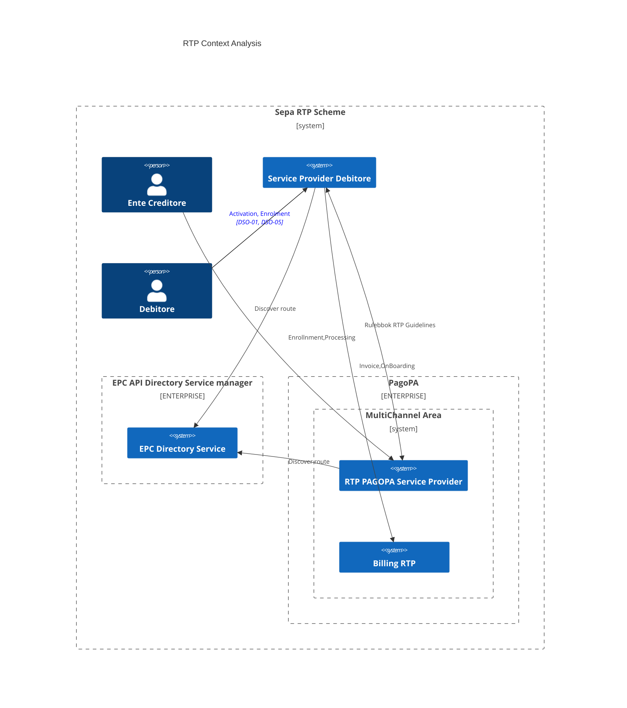

# RTP - Hypotesis 1

PagoPA vuole offire agli EC , un servizio di recapito verso applicazioni di terze parti degli avvisi di pagamento.

Le notifiche avverranno utilizzando lo schema Request-to-Pay di EPC opportunamente esteso ( con il consenso di BKI e in accordo con il Tavolo dei pagamenti per la pubblica Amministrazione ) per consentire l'esecuzione del pagamento tramite pagoPA piuttosto che tramite strumenti qualsi SCT e/o SCT Inst come previsto all'interno del Rulebook.

In tale scenario gli Attori coinvolti sono : 

- Ente Creditore: soggetto che emette l'avviso di pagamento 
- Debitore (Cittadino): Intestario dell'avviso di pagamento 
- Service Provider Debitrore: Soggetto tecnico in grado di veicolare , in accordo con le specifiche tecniche , le richieste di pagamento verso il Cittadino. In aggiunta a quanto previsto dal Rulebook è necessario che il soggetto venga riconosciuto da PagopA al fine di verificare : 
    - la possibilità ( diretta/ indiretta ) di eseguire il pagamento pagoPA richiesto
    - fatturare il servizio
- PagoPA : Come Service Provider dell'EC, rivolge quindi un ruolo di parter tecnico in grado di veicolare le informazioni di pagamento tramite lo schema RTP 
- EPC Directory Service: E' un soggetto, nominato da EPC, che ha il ruolo di registrare e conservare ipuntamenti ai servizi necessari per l'esecuzione dello schema RTP.

#