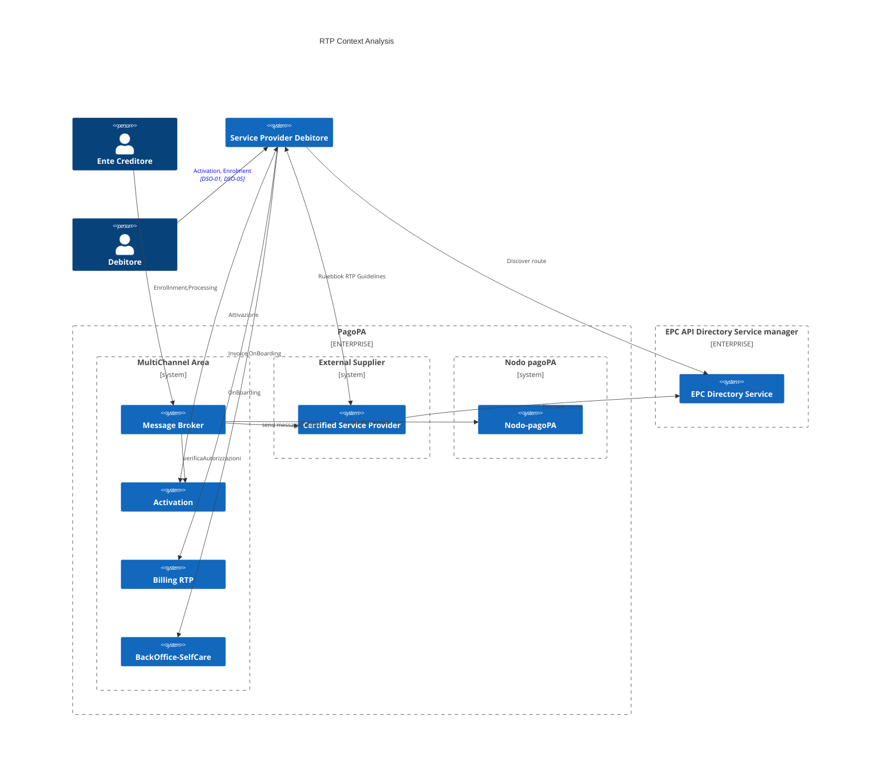

# RTP - Hypotesis 1

PagoPA vuole offire agli EC , un servizio di recapito verso applicazioni di terze parti degli avvisi di pagamento.

Le notifiche avverranno utilizzando lo schema Request-to-Pay di EPC opportunamente esteso ( con il consenso di BKI e in accordo con il Tavolo dei pagamenti per la pubblica Amministrazione ) per consentire l'esecuzione del pagamento tramite pagoPA piuttosto che tramite strumenti qualsi SCT e/o SCT Inst come previsto all'interno del Rulebook.

In tale scenario gli Attori coinvolti sono : 

- Ente Creditore: soggetto che emette l'avviso di pagamento 
- Debitore (Cittadino): Intestario dell'avviso di pagamento 
- Service Provider Debitrore: Soggetto tecnico in grado di veicolare , in accordo con le specifiche tecniche , le richieste di pagamento verso il Cittadino. In aggiunta a quanto previsto dal Rulebook è necessario che il soggetto venga riconosciuto da PagopA al fine di verificare : 
    - la possibilità ( diretta/ indiretta ) di eseguire il pagamento pagoPA richiesto
    - fatturare il servizio
- PagoPA : Come Service Provider dell'EC, rivolge quindi un ruolo di parter tecnico in grado di veicolare le informazioni di pagamento tramite lo schema RTP 
- EPC Directory Service: E' un soggetto, nominato da EPC, che ha il ruolo di registrare e conservare ipuntamenti ai servizi necessari per l'esecuzione dello schema RTP.

## PagoPA Context
All'interno del perimetro di PagoPA abbiamo indivuato i seguenti ruoli : 

- Activation
- Certified Service Provider
- Billing
- Message Broker

### Activation

Come riportato all'interno della chiarificazioni del Rulebbok 

>The enrolment and activation processes are mandatory but can be >done in many ways left at the discretion
>of the actors.
>
>[...]
>
>The Activation is the mutual arrangement between one Payer which agrees to receive SRTP messages and
one Payee that agrees to send SRTP messages, and the exchange of the required information (e.g., SRTP
addresses) enabling the Payee and/or the Payee’s SRTP Service Provider to send SRTP messages to the
Payer and enabling the Payer to receive SRTP messages from the Payee.

PagoPA offre un proceso di autorizzazione comune per tutti gli EC, tramite questo processo un Debitore sarà in grado di autorizzare la ricezione di messaggi di pagamento da qualsiasi Ente che utilizzi PagoPA come service provider. Potrà 
- Visualizzare tutti gli Enti abilitati all'invio ( ed eventuale tassonomia ) 
- Selezionare selettivamente tipologia di tributi e/o Ente

### Certified Service Provider
Per poter implementare la masseggistica dello schema RTP PagoPA si avvarrà di un fornitore esterno che metterà a disposizione di PagoPA stessa il ruolo di Service Provider, certificando PagoPA come Service Provider dello schema EPC.

### BackOffice SelfCare
Essendo il pagamento pagoPA una deviazione dallo standard EPC ed essenmdo prevista una remunerazione del servizio, è necessario registrare tramite un apposito BackOffice i Service Provider che offrono il servizio di RTP compatibile con pagoPA.
### Billing
Il modello di business individuato prevede che i Service Provider dovranno remunerare il servizio in base al numero di messaggi ricevuti. Pertanto sarà necessario produrre fatturazione ed integrazione verso i servizi aziendali di fatturazione ( SAP )

### Message Broker
Ad oggi non è ancora chiarito quale sarà il punto di ingresso dei messaggi da parte degli Enti. Il compito di tale componente sarà : 
- acquisire i messaggi
- verificare la disponibilità del pagamento sul nodo pagoPA
- verificare l'autorizzazione e recuperare l'indirizzo del service provider del destinatario del messaggio
- inoltrare il messaggio al fornitore esterno per invio della RTP 

#