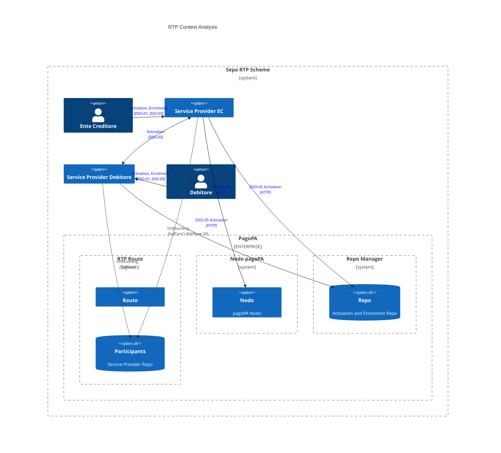

# RTP - Hypotesis 1

## Components

### rtp_route 

### repomgr

### nodo

## Requirements

Come Service Provider voglio verificare che qualsiasi richiesta di pagaamento sia effettivamente associata ad un avviso di pagamento disponibile sul Nodo.

Ogni richiesta di attivazione deve essere collezionata nel repo_manager

## Assumptions

- il sistema pagopa-RTP deve conoscere ogni messaggio ( e relativo avviso di pagamento ) inoltrato ai debitori per poter cancellare le richieste una volta che il pagamento viene eseguito.

