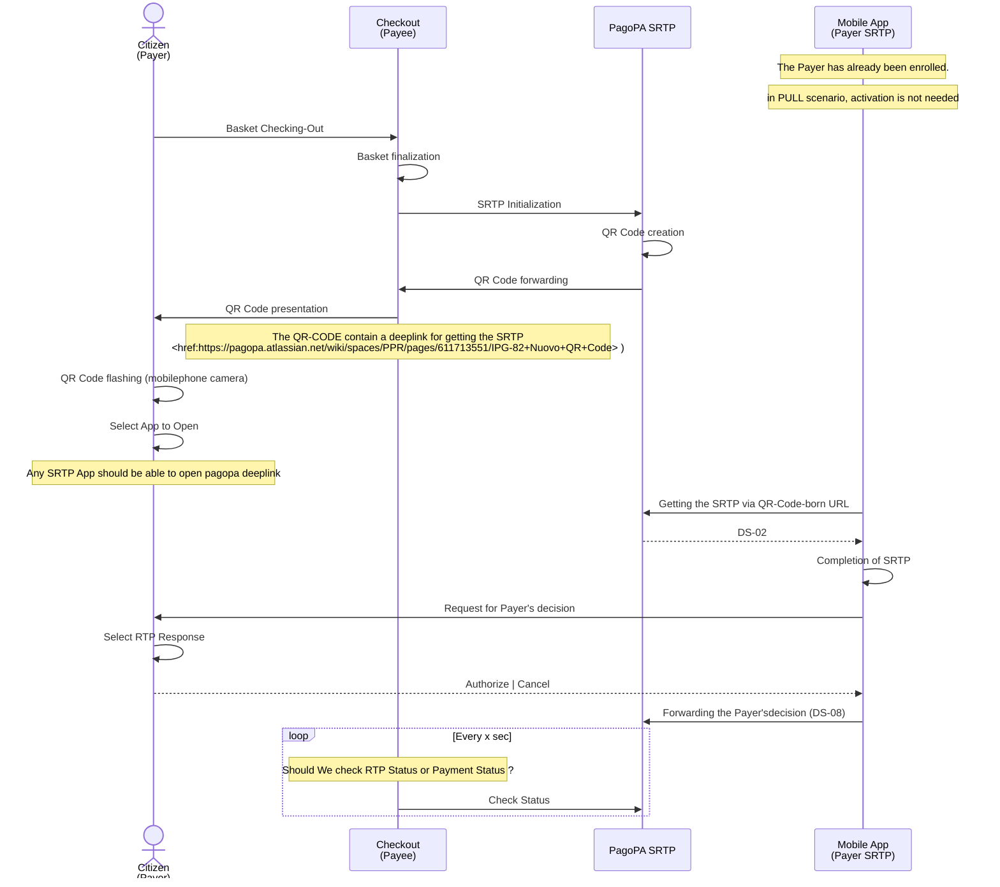

---
title: Checkout with RTP ( based on 2.9.2 Clarification Paper SRTP Rulebook)
---

```mermaid 

sequenceDiagram

actor user as Citizen  <br> (Payer)
participant checkout as Checkout  <br> (Payee)
participant rtp as PagoPA SRTP
participant srtp_deb as Mobile App <br>(Payer SRTP)

note over srtp_deb : The Payer has already been enrolled. 
note over srtp_deb : in PULL scenario, activation is not needed


user ->> checkout : Basket Checking-Out 
checkout ->> checkout : Basket finalization 
checkout ->> rtp: SRTP Initialization 
rtp->>rtp : QR Code creation 
rtp ->> checkout: QR Code forwarding 
checkout ->> user: QR Code presentation
note over checkout:  The QR-CODE contain a deeplink for getting the SRTP <br/> <href:https://pagopa.atlassian.net/wiki/spaces/PPR/pages/611713551/IPG-82+Nuovo+QR+Code> ) 
user->>user : QR Code flashing (mobilephone camera)
user ->> user : Select App to Open
note over user: Any SRTP App should be able to open pagopa deeplink
srtp_deb ->> rtp : Getting the SRTP via QR-Code-born URL 
rtp -->> srtp_deb : DS-02
srtp_deb ->> srtp_deb : Completion of SRTP
srtp_deb ->> user: Request for Payer's decision 
user ->> user: Select RTP Response
user -->> srtp_deb: Authorize | Cancel
srtp_deb ->> rtp: Forwarding the Payer'sdecision (DS-08)

loop Every x sec
note over checkout : Should We check RTP Status or Payment Status ? 
        checkout->>rtp: Check Status
    end
```