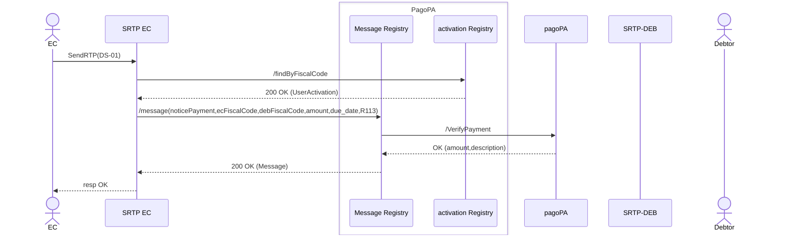
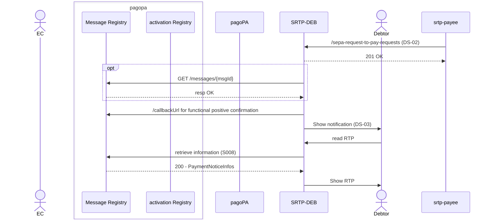

## Fase preliminare 

```mermaid
sequenceDiagram

actor ec as EC
participant srtp-payee as SRTP EC
box PagoPA 
participant srv as Message Registry
participant act as activation Registry
end
participant nodo as pagoPA
participant srtp as SRTP-DEB
actor deb as Debtor

ec ->> srtp-payee : SendRTP(DS-01) 
srtp-payee ->> act : /findByFiscalCode
act -->> srtp-payee : 200 OK (UserActivation)
srtp-payee ->> srv : /message(noticePayment,ecFiscalCode,debFiscalCode,amount,due_date,R113)
srv ->> nodo : /VerifyPayment
nodo -->> srv : OK (amount,description)
srv -->> srtp-payee : 200 OK (Message)

srtp-payee -->> ec : resp OK
```

## Invio di RTP 

```mermaid
sequenceDiagram

actor ec as EC

box pagopa
participant srv as Message Registry
participant act as activation Registry
end

participant nodo as pagoPA
participant srtp as SRTP-DEB
actor deb as Debtor

srtp-payee ->>srtp : /sepa-request-to-pay-requests (DS-02) 
srtp -->> srtp-payee: 201 OK 
opt
srtp->> srv : GET /messages/{msgId}
srv -->> srtp: resp OK
end
srtp ->> srv : /callbackUrl for functional positive confirmation
srtp ->> deb : Show notification (DS-03)

deb ->> srtp: read RTP
srtp ->> srv : retrieve information (S008)
srv -->> srtp : 200 - PaymentNoticeInfos
srtp ->> deb : Show RTP 

```

## Accettazione / Rifiuto 
