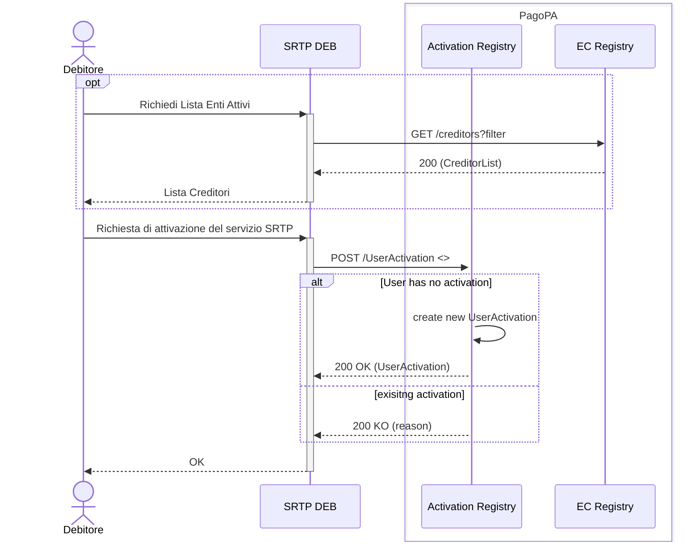

```mermaid
sequenceDiagram


    actor user as Debitore
    participant srtp as SRTP DEB
    box PagoPA
    participant act as Activation Registry
    participant ecr as EC Registry
    end

opt 
user ->>+ srtp: Richiedi Lista Enti Attivi
srtp ->> ecr : GET /creditors?filter
ecr -->> srtp : 200 (CreditorList)
srtp -->>- user: Lista Creditori
end 

user->>+srtp: Richiesta di attivazione del servizio SRTP
srtp->>+act: POST /UserActivation <>

alt User has no activation 
act ->> act : create new UserActivation
act -->>srtp : 200 OK (UserActivation)
else exisitng activation
act -->> srtp : 200 KO (reason)
end

srtp -->>- user: OK
```